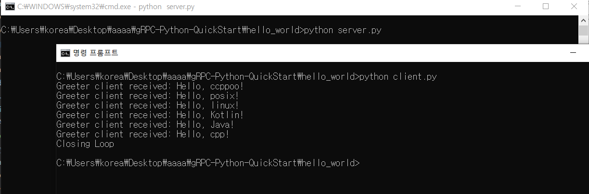
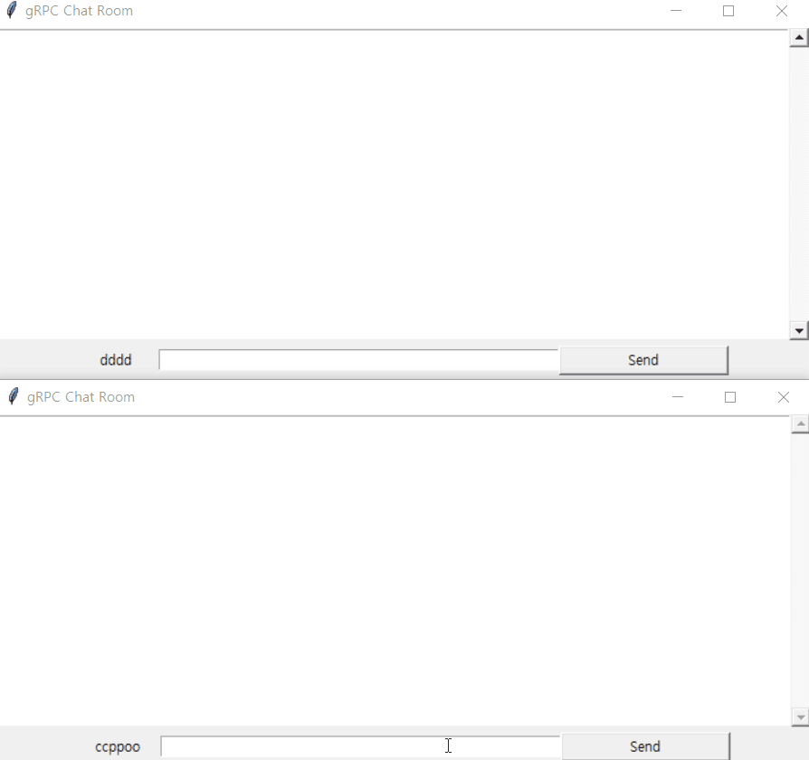

# gRPC-Python-QuickStart

clean gRPC-Python start kit

Simple working exmample for Python gRPC

Because [example](https://github.com/grpc/grpc) given from the
[gRPC offical site](https://grpc.io/docs/languages/python/quickstart/) is too large to handle for those who just want to make with python.

I will add my own sample and also cover most of the examples from [gRPC repository](https://github.com/grpc/grpc/tree/master/examples/python)

## 1. Hello World - from [gRPC/gRPC](https://github.com/grpc/grpc)

Basic example from [gRPC/gRPC](https://github.com/grpc/grpc)

## 2. chat with GUI [chat](./chat/README.md)

Using basic gRPC server and client(Sync) with GUI(tkinter)

## 3. chat with GUI [chat_stream](./chat_stream/README.md)

Uses same GUI script(gui.py from `2.chat with GUI`) but use streaming connection

## 4. [Bidrectional streaming](./bidirection/README.md)

working in progress

## 5. [interceptor](./interceptor/README.md)

working in progress
