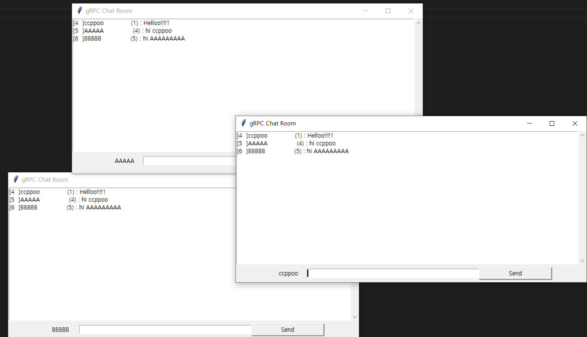

# 1. Chat (with GUI)

Start server

```
path/to/GRPC-PYTHON-QUICKSTART/chat >> chat_server.py
```

run multiple client(with GUI)

```
path/to/GRPC-PYTHON-QUICKSTART/chat >> gui.py YOUR_NICK_NAME
```


