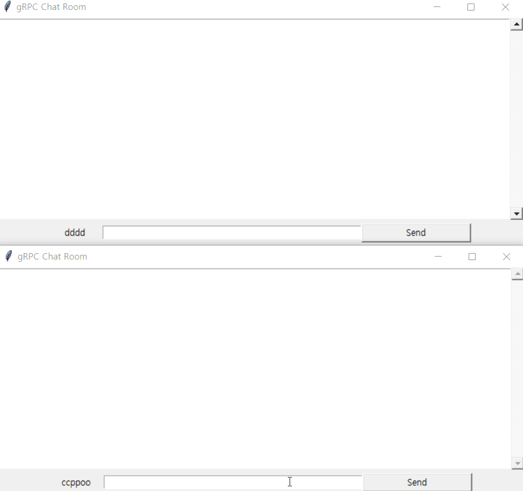

# 1. Chat (with GUI) - Unary

Usage:

First, Start server

```
path/to/GRPC-PYTHON-QUICKSTART/chat> python chat_server.py
```

Then, run multiple client(GUI)

```
path/to/GRPC-PYTHON-QUICKSTART/chat> python gui.py <YOUR_NICK_NAME>
```


