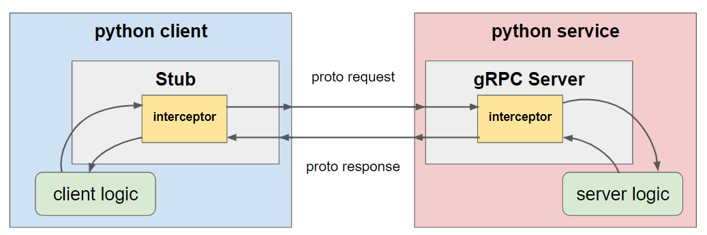
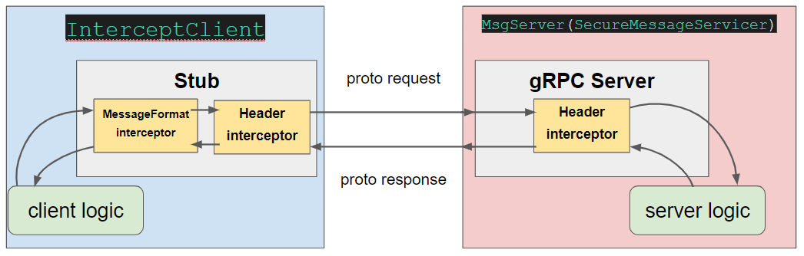

# 5. Interceptor

Interceptors literally intercept payloads, and could read/write in some case.

Interceptors work just like **proxy + reverse-proxy** for both client and server.

Interceptors, intercept every proto requests and response like image below



But you **don't have to implement logic for every method** used at client side.

Python implementation at grpc/\_interceptor.py, if you see [line 492 ~ 501](https://github.com/grpc/grpc/blob/f3ef6869d6e6287c4e00dca4cd854fe023d62ed7/src/python/grpcio/grpc/_interceptor.py#L492-L501)

```python
class _Channel(grpc.Channel):

  ...

  def unary_unary(self,
                  method,
                  request_serializer=None,
                  response_deserializer=None):

        thunk = lambda m: self._channel.unary_unary(m, request_serializer,
                                                    response_deserializer)

        # Here ↓ ↓ ↓
        if isinstance(self._interceptor, grpc.UnaryUnaryClientInterceptor):
            return _UnaryUnaryMultiCallable(thunk, method, self._interceptor)
        else:
            return thunk(method)
```

interceptor channel class(`_Channel`) passes the interceptor if not inherited.

See example code at [messageFormatInterceptor.py - class MessageFormatInterceptor](./interceptors/client/messageFormatInterceptor.py)

As you could see in the image, at client side, interceptors receives response from server ahead of client side.

Interceptors could also manipulate response from server, for example, handling error and replace with default value.

See example code at grpc/grpc example code - [default_value](https://github.com/grpc/grpc/tree/master/examples/python/interceptors/default_value)

## Summary

**client side interceptors could...**

- read/write meta data (that could use like header, cookie - [exmaples at grpc/grpc](https://github.com/grpc/grpc/tree/master/examples/python/interceptors/headers))

- read/write proto buffs(message)

**server side interceptors could...**

- read/write meta data

- could some how read/write meta data

---

## Example code brief explaination



- message format interceptor (client)

- header interceptor (server, client)

### Client Side Interceptor

- messageFormatInterceptor
  `/interceptors/client/messageFormatInterceptor.py`
  This interceptor modifies string in protocol buffer(`/protos/interceptSample.proto :: message Load`)

  If string value starts with lower case, it makes to upper case

- headerInterceptor

  adds metadata at client's payload

### Server side

- headerInterceptor

  Reads metadata of client's payload
  Rejects if necessary payload is not contained
